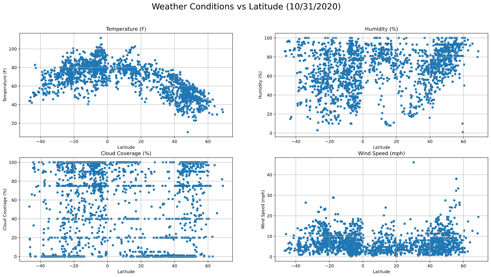
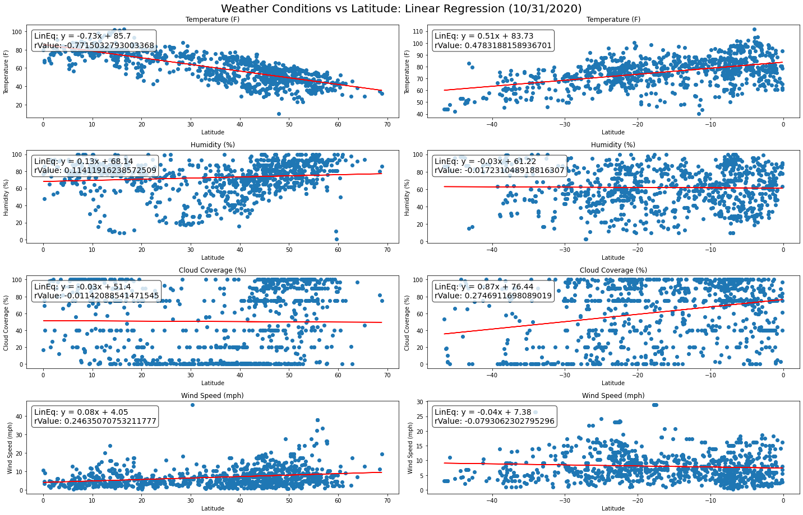

# Investigating the realtionship between weather and latitude through APIs
In this exercise, I was asked to investigate the relationship between different weather metrics and the latitudes at which these metrics were recorded. The metrics are temperature, humidity, cloud coverage, and wind speed. The data that was used in this exercise was pulled from the [Open Weather API](https://openweathermap.org/ "Open Weather API") as well as the [Citipy]("https://github.com/wingchen/citipy" "Citipy") python library. Technologies used include Python, Jupyter Notebooks, Pandas, Requests, Matplotlib, gMaps, and the Google Places API. Below are the plots that were generated from this exercise along with some observations.

**1. Temperature vs Latitude (upper left):**  
There seems to be a corelation between temperature and latitude. The closer to the equator, the hotter it gets.

**2. Humidity vs Latitude (upper right):**  
I'm not sure if this can be called corrilated or not, but it does seem like it's consistantly humid on and around the equator. Once you start moving away, it's a toss up.

**3. Cloud Coverage vs Latitude (lower left):**  
No correlation whatsoever. The plot is all over the place and I can confidently say that latitude has nothing to do with cloud coverage.

**4. Wind Speed vs Latitude (lower right):**
As with cloud coverage, wind speed seems to be uneffected by latitude.

The plots above show linear regression models for each relationship for cities in the northern (left column) and southern (right column) hemisphere. When looking at these plots, you can see that our results are pretty much the same. The only metric that correlates with latitude is temperature. The other three metrics show no signs of correlation.